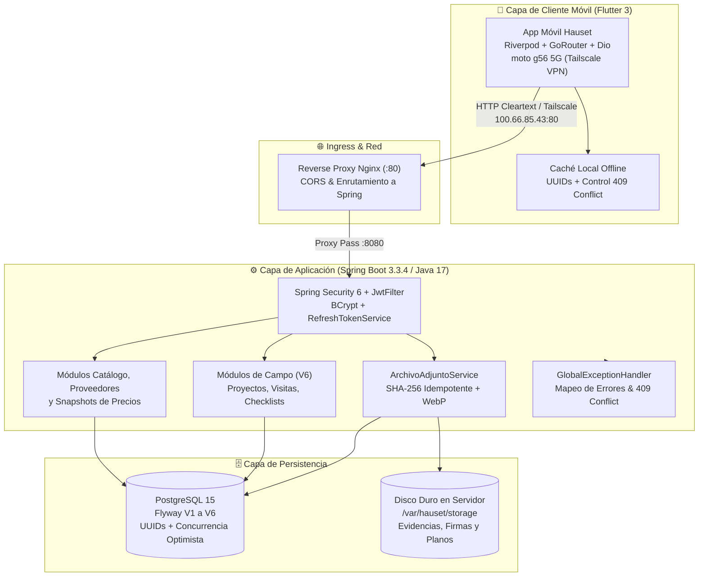
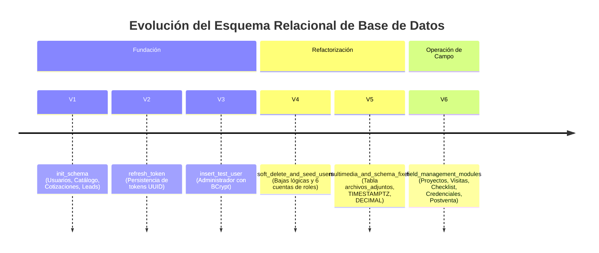

# Informe Oficial de Auditoría Técnica y Avances de Ingeniería
**Sistema de Gestión de Operaciones de Campo para Domótica — Hauset**

> **Fecha de Auditoría:** Septiembre 2026  
> **Auditor Responsable:** Antigravity Engineering & Software Quality Audit  
> **Alcance:** Backend (Spring Boot 3.3.4 / Java 17), Frontend Móvil (Flutter 3 / Riverpod 2.6.1), Infraestructura (Docker, Nginx, MinIO, PostgreSQL 15)  
> **Artefacto Interactivo Generado:** Carpeta [`informe/`](file:///home/agent/proyectos/hauset/informe/index.html) (`index.html`, `styles.css`, `app.js`)

---

## 1. Resumen Ejecutivo & Scorecard de Calidad

El sistema **Hauset** fue concebido para resolver la desconexión operativa y comercial en empresas de domótica, seguridad electrónica y automatización electromecánica. 

Tras una inspección exhaustiva de los repositorios [`hauset`](file:///home/agent/proyectos/hauset) y [`hauset_mobile_client`](file:///home/agent/proyectos/hauset_mobile_client), el análisis de los esquemas de base de datos Flyway (V1 a V6), y la verificación en tiempo de ejecución de los contenedores Docker y endpoints activos, se emite el siguiente **Dictamen de Auditoría**:

> [!IMPORTANT]
> **Dictamen:** **APROBADO CON OBSERVACIONES OPERATIVAS (Índice de Madurez: 70/100)**  
> La infraestructura base, el control de concurrencia optimista, el modelo de identificadores UUID descentralizados, el motor de archivos desacoplado (Opción B) y los módulos de Autenticación, Catálogo de Productos y Registro de Precios se encuentran en estado **100% operativo y funcional**. La fase inmediata prioritaria consiste en avanzar con la interfaz de usuario en Flutter (actualmente en fase inicial de Auth/red) y exponer los controladores REST para los módulos de obra (Flyway V6).

### 1.1. Tabla de Madurez por Capa

| Capa del Sistema | Estado | Cobertura / Avance | Observaciones de Auditoría |
| :--- | :---: | :---: | :--- |
| **Infraestructura & Contenedores** |  Operativo | 95% | Docker Compose con Spring Boot, Nginx (:80), PostgreSQL 15 (:5432) y volumen de Disco Duro en el Servidor. |
| **Seguridad & Identidad** |  Operativo | 100% | JWT con claims (`id`, `nombre`, `rol`), Refresh Tokens UUID en BD, contraseñas BCrypt, endpoint `/me`. |
| **Base de Datos & Migraciones** |  Operativo | 100% | 6 migraciones Flyway consolidadas sin drift. Índices en FKs, `TIMESTAMPTZ` y precisión `DECIMAL(12,2)`. |
| **Módulo Catálogo & Proveedores** |  Operativo | 100% | CRUD proveedores, productos por categoría, historial de snapshots y cotización de menor a mayor. |
| **Motor Multimedia (Opción B)** |  Operativo | 90% | `archivos_adjuntos` centralizada, almacenamiento en disco duro del servidor (`/var/hauset/storage`), hash SHA-256 e idempotencia. |
| **Módulos de Obra / Campo (V6)** | ⚠️ En Modelado | 60% | 11 tablas y entidades JPA creadas; falta la capa de Controladores y Servicios REST. |
| **Frontend Móvil (Flutter)** | 🔄 Fase Inicial | 20% | Arquitectura base, Auth/Session y red validados en hardware real; catálogo y módulos de campo en desarrollo. |

---

## 2. Arquitectura del Sistema & Decisiones de Diseño (ADRs)



### 2.1. Registro de Decisiones de Arquitectura (ADRs)

* **ADR-01: Identificadores Universales UUID V4:** Permite a la app Flutter generar identificadores locales de visitas, checklist y fotos en zonas sin conectividad (offline), garantizando sincronización con PostgreSQL sin colisiones.
* **ADR-02: Control de Concurrencia Optimista (`version` & HTTP 409):** Entidades susceptibles a edición concurrente (`cotizaciones`, `proyectos`, `checklist_tareas`, `visitas`) incorporan `@Version`. Si un instalador o la secretaría guardan sobre una versión desactualizada, el servidor emite un `409 Conflict`, capturado en Flutter mediante `ConflictFailure`.
* **ADR-03: Arquitectura Multimedia Centralizada (Opción B):** Ninguna tabla de dominio contiene columnas de URLs o binarios. La tabla `archivos_adjuntos` vincula polimórficamente archivos (`entidad_tipo`, `entidad_id`, `categoria`) con almacenamiento en el disco duro del servidor (`/var/hauset/storage`) y hash SHA-256 para prevenir subidas repetidas por inestabilidad de red.
* **ADR-04: Desacoplamiento Comercial vs Operativo:** La cotización aprobada congela el precio comercial. Las instrucciones de trabajo en sitio son técnicas y versionadas (`instrucciones_version` 1..N). Los imprevistos en sitio que requieran material generan un `cotizacion_extras` (adenda) sin anular el contrato original.
* **ADR-05: Catálogo Dinámico sin Precio Fijo de Proveedor:** Dada la constante fluctuación de precios de los distribuidores, el sistema almacena un historial cronológico de cotizaciones en `precios_historial`. La app móvil cotiza consultando los últimos precios ordenados de menor a mayor.
* **ADR-06: Trazabilidad Estricta de Credenciales de Clientes:** Toda consulta a las contraseñas de cámaras o routers del cliente genera un registro inmutable en `credenciales_accesos_log`, permitiendo la visibilidad técnica en campo con control de auditoría.

---

## 3. Auditoría de Base de Datos (Flyway Migrations V1 a V6)



### 3.1. Detalle de Migraciones Auditadas
1. [V1__init_schema.sql](file:///home/agent/proyectos/hauset/src/main/resources/db/migration/V1__init_schema.sql): Tablas núcleo de usuarios, clientes, leads, catálogo de productos, proveedores, cotizaciones e informes técnicos.
2. [V2__refresh_token.sql](file:///home/agent/proyectos/hauset/src/main/resources/db/migration/V2__refresh_token.sql): Almacén persistente de Refresh Tokens con fecha de expiración.
3. [V3__insert_test_user.sql](file:///home/agent/proyectos/hauset/src/main/resources/db/migration/V3__insert_test_user.sql): Usuario administrador para pruebas iniciales.
4. [V4__soft_delete_and_seed_users.sql](file:///home/agent/proyectos/hauset/src/main/resources/db/migration/V4__soft_delete_and_seed_users.sql): Adición de `activo` en proveedores y catálogo de productos; siembra de 6 usuarios representativos para cada rol del sistema con contraseña `123456`.
5. [V5__multimedia_and_schema_fixes.sql](file:///home/agent/proyectos/hauset/src/main/resources/db/migration/V5__multimedia_and_schema_fixes.sql): Creación de `archivos_adjuntos` (Opción B), normalización a `TIMESTAMPTZ`, ajuste a `DECIMAL(12,2)` e indexación de foreign keys.
6. [V6__field_management_modules.sql](file:///home/agent/proyectos/hauset/src/main/resources/db/migration/V6__field_management_modules.sql): Módulos operativos de campo: `proyectos`, `instrucciones_version`, `cambios_instruccion`, `checklist_tareas`, `visitas`, `firmas_conformidad`, `reportes_entrega`, `equipos_instalados`, `credenciales_equipo`, `credenciales_accesos_log` y `mantenimiento_recordatorios`.

---

## 4. Matriz de Control de Acceso (RBAC)

El sistema define 6 roles con responsabilidades y privilegios delimitados:

| Rol | Gestión Usuarios | CRUD Proveedores | CRUD Productos | Registro Precios | Cotización & Margen | Cambios en Obra | Checklist & Fotos | Ver Credenciales |
| :--- | :---: | :---: | :---: | :---: | :---: | :---: | :---: | :---: |
| `JEFE_SISTEMAS` |  Total |  Total |  Total |  Total |  Aprueba |  Aprueba |  Supervisa | 👁️ Auditado |
| `JEFE_ELECTROMECANICO` |  Total |  Total |  Total |  Total |  Aprueba |  Aprueba |  Supervisa | 👁️ Auditado |
| `INGENIERO_INDUSTRIAL` | ❌ |  Total |  Total | ❌ Lectura | ❌ | ❌ |  Supervisa | 👁️ Auditado |
| `SECRETARIA` | ❌ |  Total | ❌ |  Permitido | ❌ Arma | ❌ | ❌ | 👁️ Auditado |
| `INSTALADOR` | ❌ | ❌ | ❌ | ❌ Lectura | ❌ | ⚠️ Propone |  Operador Clave | 👁️ Auditado |
| `MARKETING` | ❌ | ❌ | ❌ | ❌ Lectura | ❌ | ❌ | ❌ | ❌ |

---

## 5. Inventario de Endpoints REST Verificados

Se auditaron y probaron en vivo mediante peticiones autenticadas:

* **Autenticación & Cuentas:**
  * `POST /api/usuarios/login`: Retorna JWT y Refresh Token UUID.
  * `POST /api/usuarios/refresh-token`: Renueva token conservando claims.
  * `GET /api/usuarios/me`: Obtiene identidad y estado activo de la sesión.
  * `GET /api/usuarios/admin`: Listado administrativo con filtros de rol y estado *(Jefes)*.
  * `POST /api/usuarios/admin`: Creación de usuarios con hash BCrypt *(Jefes)*.
* **Proveedores:**
  * `GET /api/proveedores`: Listado paginado con búsqueda por nombre y categoría.
  * `GET /api/proveedores/todos`: Lista no paginada para selectores en Flutter.
  * `POST /api/proveedores`: Registro de nuevo distribuidor.
  * `DELETE /api/proveedores/{id}`: Baja lógica con flag `activo=false`.
* **Catálogo de Productos:**
  * `GET /api/catalogo/productos`: Listado paginado con filtros por `categoria` enum.
  * `POST /api/catalogo/productos`: Creación de equipo en catálogo.
* **Historial & Snapshots de Precios:**
  * `POST /api/catalogo/precios`: Registro de precio neto *(Exclusivo Secretaria y Jefes)*.
  * `GET /api/catalogo/precios/producto/{id}/ultimos`: Lista del mejor precio por proveedor (menor a mayor).
  * `GET /api/catalogo/precios/producto/{id}`: Historial cronológico paginado.
* **Multimedia Centralizada:**
  * `POST /api/v1/archivos/upload`: Subida multipart con verificación de hash SHA-256 e idempotencia.
  * `GET /api/v1/archivos/entidad/{tipo}/{id}`: Lista de archivos asociados a una entidad.
  * `GET /api/v1/archivos/{id}/descargar`: Streaming binario con headers de caché e inline disposition.

---

## 6. Hallazgos de Auditoría & Plan de Mitigación

> [!WARNING]
> ### Hallazgo H-01 (Prioridad Alta): Cifrado en Reposo de Credenciales de Clientes
> * **Situación:** La tabla `credenciales_equipo` tiene la columna `contrasena_cifrada`, pero aún no se ha acoplado un algoritmo simétrico en JPA.
> * **Acción Requerida:** Implementar un `AttributeConverter<String, String>` en Spring Data JPA utilizando **AES-256-GCM** con clave maestra inyectada desde variables de entorno.

> [!NOTE]
> ### Hallazgo H-02 (Prioridad Media): Exposición de Controladores de Campo (V6)
> * **Situación:** Las 11 tablas de operaciones de obra (V6) ya cuentan con sus Entidades y Repositorios en `com.appdomotica.proyectos`, pero falta crear la capa de Servicios y Controladores REST (`ProyectoController`, `VisitaController`, `ChecklistTareaController`).
> * **Acción Requerida:** Construir los DTOs y Controllers REST para el Sprint de Operaciones de Campo.

> [!TIP]
> ### Hallazgo H-03 (Prioridad Media): Activación de SQLite en Flutter
> * **Situación:** La biblioteca `sqflite` en `pubspec.yaml` se encuentra comentada; las llamadas se ejecutan exclusivamente en vivo vía `DioClient`.
> * **Acción Requerida:** Descomentar y estructurar la caché local para catálogo y checklists, garantizando la promesa de diseño Offline-First.

---

## 7. Instrucciones para Consultar el Dashboard Interactivo

Se ha compilado un tablero interactivo completo en la carpeta [`informe/`](file:///home/agent/proyectos/hauset/informe/index.html):
* Para abrirlo en cualquier navegador web:
  ```bash
  # Iniciar un servidor HTTP local ligero o abrir directamente:
  xdg-open /home/agent/proyectos/hauset/informe/index.html
  # O servirlo vía python:
  cd /home/agent/proyectos/hauset/informe && python3 -m http.server 8081
  ```
* El dashboard incluye:
  1. Explorador dinámico del **Diccionario de Datos** con filtros por categoría y búsqueda de columnas.
  2. Catálogo interactivo de **Endpoints REST** con payloads JSON de solicitud y respuesta.
  3. Matriz **RBAC** visual con resaltado de accesos auditados.
  4. Botón para **Exportar Datos en JSON** y vista optimizada para **Impresión / PDF**.
